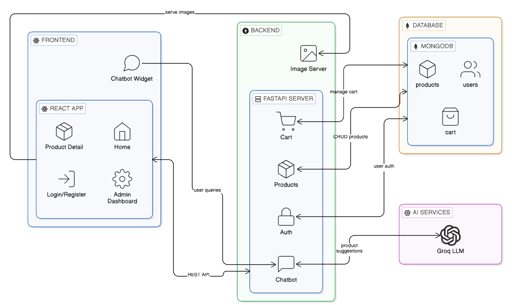

# 🛍️ ClothStore AI - Interactive E-commerce Assistant



ClothStore AI is a modern, agentic e-commerce platform that leverages **Natural Language Processing (NLP)** and **Text-to-NoSQL** to provide a seamless shopping experience. Built with a premium stack, it features an AI-powered shopping assistant that helps users find products, check prices, and navigate categories naturally.

## 🚀 Modern Tech Stack

*   **FastAPI**: High-performance backend framework for the API layer.
*   **MongoDB Atlas**: Distributed NoSQL database for flexible product and order management.
*   **PydanticAI**: Next-generation agentic framework for building robust AI tools and flows.
*   **Groq (Qwen 3 32B)**: Blazing-fast LLM inference powering the assistant's intelligence.
*   **Logfire**: Advanced observability for tracking AI agent performance and debugging queries.
*   **UV**: Ultra-fast Python package installer and resolver.

## ✨ Key Features

*   **🧠 Intelligence**: Understands natural language queries like *"show me men's shirts under ₹2000"*.
*   **🔍 Fuzzy Search**: Smart keyword extraction that handles pluralization and spelling variations.
*   **⚡ High Performance**: Ultra-fast response times powered by Groq and optimized MongoDB queries.
*   **📊 Insightful Observability**: Full tracing of every AI interaction via Logfire.
*   **🛒 Modular Architecture**: Cleanly separated routes for Cart, Products, Chatbot, and Orders.

## 🛠️ Project Structure

```bash
├── backend/            # Core API and business logic
│   ├── routes/         # Chatbot, Cart, Products, and Order endpoints
│   ├── models.py       # Pydantic data schemas
│   └── database.py     # MongoDB connection setup
├── experiments/        # Jupyter notebooks for data exploration
├── main.py             # Application entry point
├── requirements.txt    # Project dependencies
└── .env                # Configuration and API keys
```

## ⚙️ Setup & Installation

1.  **Clone the Repository**:
    ```bash
    git clone https://github.com/lokesh-repaka/ecommerce-ai.git
    cd ecommerce-ai
    ```

2.  **Environment Configuration**:
    Create a `.env` file and add your credentials:
    ```env
    MONGO_URI=your_mongodb_uri
    GROQ_API_KEY=your_groq_key
    LOGFIRE_TOKEN=your_logfire_token
    ```

3.  **Install Dependencies**:
    ```bash
    uv pip install -r requirements.txt
    ```

4.  **Run the Server**:
    ```bash
    python main.py
    ```

## 👨‍💻 Author

**Lokesh Repaka**
*   LinkedIn: [Your Profile Link Here]
*   GitHub: [@lokesh-repaka](https://github.com/lokesh-repaka)

---
*Built with ❤️ using Antigravity AI*
